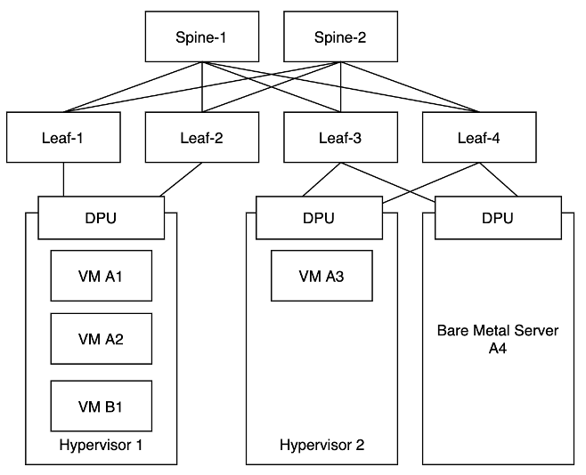

# Idea

Gardener on Metal provides an infrastructure to run Cloud Native Applications. Multiple tenants should use this infrastructure in a secure way. They should not interfere with each others' workload. Noisy neighbor disturbances should be avoided as best as possible.

### Clos Topology

Gardener on Metal relies on a Layer 3 based clos topology. Layer 2 is only used between to connected nodes. All traffic that travels across the network will be routed. BGP is used to distribute routing information. More information about Layer 3 clos topologies in data centers and BGP can be found in [RFC7938](https://datatracker.ietf.org/doc/html/rfc7938).

The servers are connected to two different Leaf switches. 2x25 Gbps, 2x40 Gbps, 2x100 Gbps are common bandwidths. Leaf and Spine switches run SONiC and do IP routing.

A Gardener on Metal environment can host multiple customers. It is a multi-tenant environment. Customers can be evil and may not be trusted! Therefore, tenants’ workload must be separated from each other and from the underlying infrastructure. Gardener on Metal is able to provide two server types to the customers: Virtual Machines (VMs) using KVM and bare-metal servers. In the VM case the hypervisor is sandboxing the customer’s machine. The hypervisor is under control of the infrastructure provider (onmetal Team) and can be trusted. In the bare-metal case the bare-metal server cannot be trusted, as it will be under customer’s control. Gardener on Metal uses a DPU, that is not controlled by its host system but from the outside, to sandbox the bare-metal server. In this case the DPU must not provide access to the underlay network to the bare-metal server but only access to the tenants overlay network.
From a networking and storage perspective the bare-metal server should feel like a virtual machine and have the same functionality (firewalling, network block storage etc.).
The DPU should provide a NIC to the bare-metal server via PCIe, to a VM via SR-IOV as a Virtual Function or using a virtio-net device.

### IPv4 & IPv6
Most of enterprise applications that exist use IPv4 networking. But IPv4 addresses are getting scarce and some ISPs do not provide dedicated IPv4 addresses to their clients anymore. IPv6 is newer and the better internet protocol. Gardener on Metal customers should be able to chose if they want to run their cluster with an IPv4-only network, IPv4/IPv6 dual-stack or IPv6-only. The large Cloud Service Providers retro-fit their networks with IPv6 support. That's a tedious task and if you build an infrastructure with the pure focus on IPv4 migrating to IPv6 will be very difficult. With Gardener on Metal IPv6 is a first class citizen.

### Layer 3 unicast only
Modern applications use IP based communication. In the early days of networking there were also other protocols like IPX or AppleTalk. Thankfully those days are over. Still, we see some applications, that use features from the Ethernet layer, that most IP networks are based on. A typical use case is cache invalidation, that a Java application triggers via UDP broadcasts to its neighbors (see [Java Caching System](https://commons.apache.org/proper/commons-jcs/)). In datacenter networking and especially virtual networking so called [BUM traffic](https://en.wikipedia.org/wiki/Broadcast,_unknown-unicast_and_multicast_traffic) creates a lot of pain for the operator. Also modern queueing and pubsub solutions came up: ActiveMQ, RabbitMQ, Kafka, NATS. Distributing information using such queueing system is much more comfortable and reliable.

We think Ethernet based networking does not fit into the Cloud Native world! You should use IP-based protocols instead!

By removing Ethernet networks from Gardener on Metal we save lots of complexity in our infrastructure. All networking is IP based and every packet will be routed. All traffic coming from a VM or a bare metal machine will be routed by the hypervisor or a SmartNIC to the target. There is no Ethernet connectivity between two machines but an IP network. A VM has its hypervisor configured as a router:

    # ip route show
    default via 169.254.0.1 dev eno0 proto dhcp src 233.252.0.103 metric 1024
    169.254.0.1/32 dev eno0 proto dhcp scope link src 233.252.0.103 metric 1024

    # ip -6 route show
    default via fe80::1 dev eno0 proto dhcpv6 src 2001:db8::1 metric 256 pref medium
    fe80::/64 dev eno0 proto kernel metric 256 pref medium

We reduce complexity and also increase resiliency a lot by avoiding BUM traffic.

### IPv6 underlay
The Gardener on Metal underlay network uses IPv6 only. We have no need to support IPv4 in the underlay. All customer traffic is [encapsulated](encapsulation.md) in IPv6 and sent through our underlay network. IPv6 helps structuring the address space and uses globally unique addresses. No need to use the same IPv4 address space multiple times and trying to find unused address ranges.