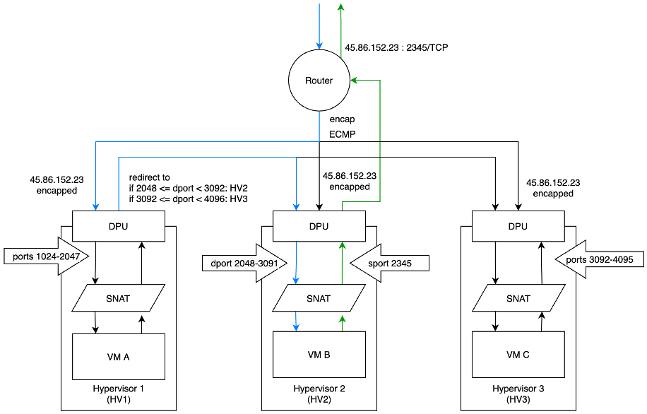
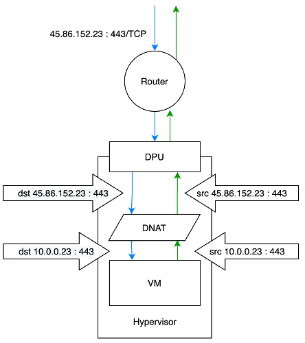
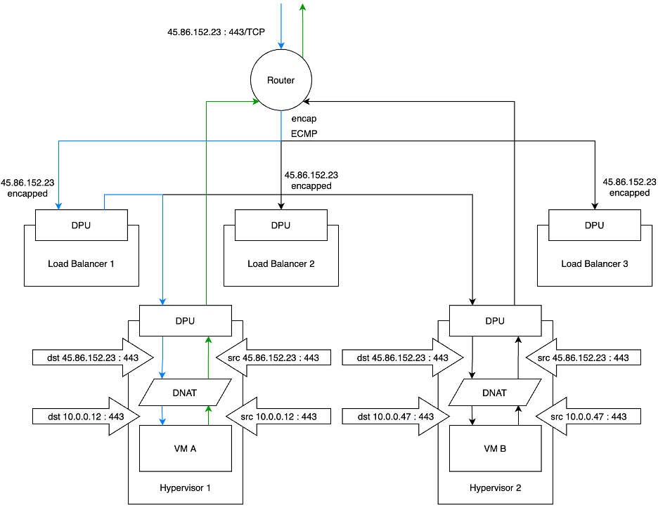

# Network Functions

## Scalable NAT Gateway

A horizontally scalable NAT gateway will be implemented. The target is to dedicate one (or more) public IPv4 address for every tenant. Different tenants must not share the same NAT gateway IP. We reduce the amount of required public IPv4 addresses by using the same address on multiple hypervisors.

In the drawing you can see three VMs of the same tenant sharing one public IPv4 NAT gateway address. VM B, residing on Hypervisor 2 (HV2), establishes an outgoing connection. The outgoing packets (green) will be SNATed to src IP 45.86.152.23 and src-port 2345. HV2 assigns src ports between 2048 and 3091 to NATed packets. This restricts the number of NATed connections for VM B to the same target IP to 1024. HV2 will send the outgoing packet via the router to the target.

Responses (blue) will ingress the cluster through the router. The router encaps the packets into the tenant’s overlay network. It uses ECMP to send the packets to the Hypervisors. The router does not know the correct target hypervisor as it does not base its routing decisions on Layer 4 information but only on IP addresses. In this example the incoming packet (dst ip: 45.86.152.23, dst port: 2345) hits HV1. HV1 is only responsible for the port range 1024-2047. According to a map it redirects the incoming packet to HV2. HV2 receives the packet, finds an entry in its conntrack table and NATs it to VM B.

To increase the number of connections per VM the port ranges can be increased. When all 65535 ports of one IP address are used (because of number of VMs and number of connections per VM), a second IP address can be added. This allows to scale the NAT gateway horizontally.

## Virtual IP Address

To realize virtual IP addresses (AWS calls them Elastic IP addresses), DNAT is used. The VM will only know about its private IP address. The virtual IP address will be translated to the VM’s private IP address. This will be done for IPv4 as well as for IPv6.

## Load Balancer

This concept is inspired by Google’s Maglev paper (https://storage.googleapis.com/pub-tools-public-publication-data/pdf/44824.pdf).

VM A (10.0.0.12) and VM B (10.0.0.47) each run an https server, that will be L4 load balanced and exposed via 45.86.152.23:443. Packet flows must be sticky to not drop TCP sessions in case of re-routing or when scaling the load balancer or the number of https servers.

Incoming packets will be routed using ECMP to the load balancer nodes. As long as the number of load balancers does not change, the packets of a 5-tuple flow will hit the same load balancer node. As soon as the number of load balancers change the ECMP hash buckets will be shuffled and the packets of a TCP flow will hit different load balancer nodes.

All load balancer nodes use the same hashing algorithm to distribute the traffic over the https servers. Additionally they remember flows according to its 5-tuple and do not look up the target for every single packet but only for the first packet of a flow. So even if the number of https servers changes, active flows will still hit the same https server.

This allows to either scale the load balancer nodes or the https servers without dropping TCP sessions.